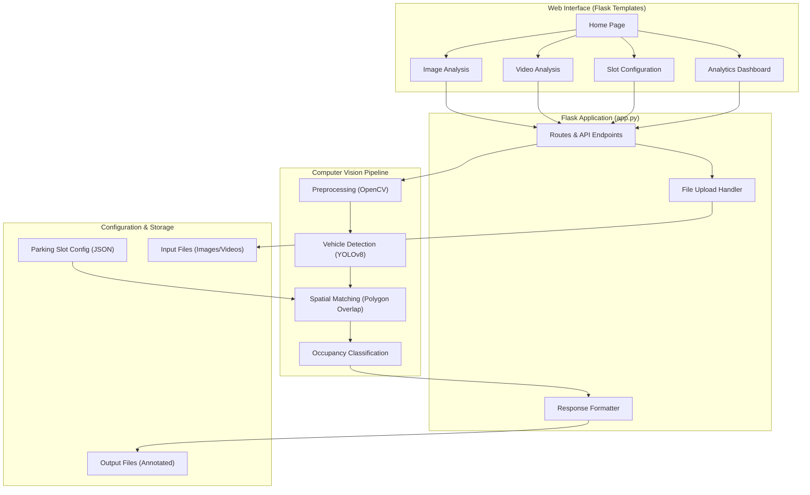

# System Architecture

The Smart Parking Space Detection system follows a modular architecture, splitting responsibilities between frontend interfaces, backend processing, and a robust computer vision pipeline.

## High-Level Architecture Diagram

## Architecture Layers

### 1. Frontend (Web Interface)
Developed using HTML, CSS, and vanilla JavaScript (with Chart.js), the frontend is served via Flask templates. It provides a user-friendly interface to upload media, tune parameters (like confidence and overlap thresholds), create slot configurations, and view analytic results dynamically.

### 2. Backend (Flask Application)
The core web server built in Python using Flask. It defines routing endpoints, handles user uploads, orchestrates the invocation of the CV pipeline, and formats responses (JSON data and images) to be returned to the frontend.

### 3. Computer Vision Pipeline (Core Engine)
The analytical heart of the application:
- **Preprocessing:** Utilizes OpenCV for enhancing image quality (grayscale, blurring, CLAHE, edge detection).
- **Vehicle Detection:** Runs the YOLOv8 deep learning model to accurately detect vehicle bounding boxes.
- **Spatial Matching:** Computes the overlap between vehicle boxes and predefined parking slot polygons using OpenCV's polygon operations.
- **Occupancy Classification:** Decides if a slot is occupied or free based on overlap thresholds.

### 4. Data Layer (Storage & Config)
Handles the persistence of input/output media and JSON configuration files detailing parking lot layouts (polygon coordinates). 
