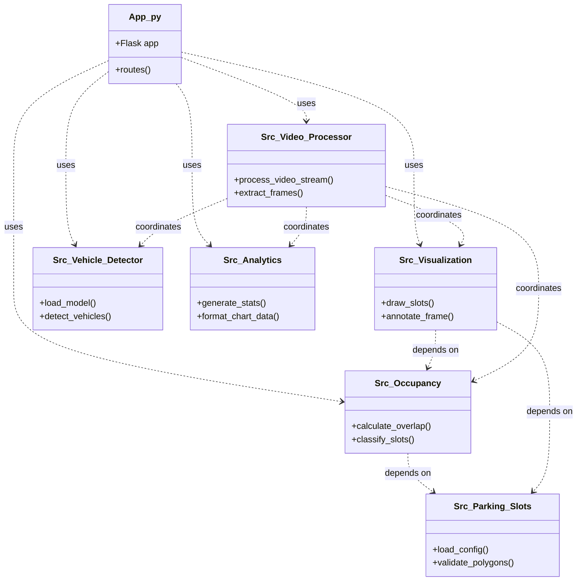

# Component Diagram

This diagram maps the internal relationships and dependencies between the core Python modules in the system.

## Component Roles
- **app.py**: The main entry point. Coordinates web requests and bridges frontend to backend logic.
- **src.occupancy**: Handles spatial mathematics (intersection logic) to determine space status.
- **src.parking_slots**: Manages the loading, parsing, and validation of user-configured JSON polygon definitions.
- **src.visualization**: Centralized module for all OpenCV drawing commands (lines, text, colors).
- **src.vehicle_detector**: Wrapper around the Ultralytics YOLOv8 API.
- **src.video_processor**: Orchestrates the frame-by-frame analysis loop for video files.
- **src.analytics**: Compiles detection data into structured JSON formats optimized for frontend Chart.js rendering.
