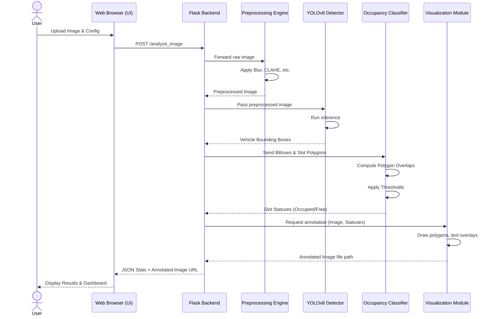

# Sequence Diagram

The sequence diagram below details the step-by-step interactions between system components during a typical image analysis request.

## Explanation
1. **Initiation**: The user submits an image via the web form.
2. **Preprocessing**: The Flask backend delegates the image to the CV pipeline for noise reduction and enhancement.
3. **Detection**: YOLOv8 scans the enhanced image to find vehicles, returning coordinate data.
4. **Classification**: The Occupancy module calculates exactly how much of a detected vehicle intersects with a configured parking slot. If the intersection exceeds the user threshold, it's marked occupied.
5. **Visualization**: The Visualization module takes the raw image and the classification results to draw colored polygons (red for taken, green for empty) and text labels.
6. **Completion**: The final compiled data and image are sent back to the browser for user consumption.
