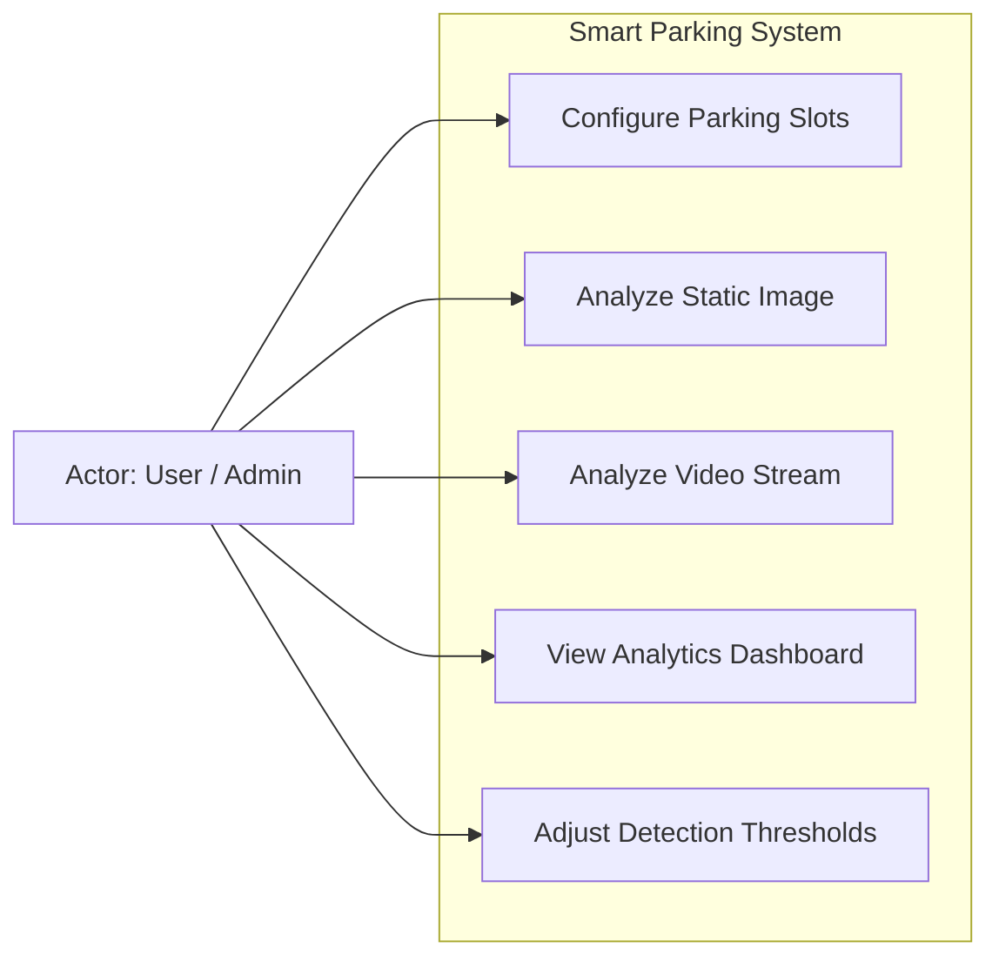

# System Use Cases

This document defines the primary actors and their interactions with the Smart Parking Space Detection system.

## Use Case Diagram

## Detailed Use Cases

### 1. Configure Parking Slots
**Actor:** User/Admin
**Description:** The user uploads a reference image of an empty or partially filled parking lot and uses a web-based drawing tool to plot polygons representing individual parking slots. These configurations are saved and reused for analysis.

### 2. Analyze Static Image
**Actor:** User
**Description:** The user uploads a snapshot of a parking lot. The system applies the CV pipeline to detect cars and map them to configured slots, outputting an annotated image with overlaid status colors and current occupancy stats.

### 3. Analyze Video Stream
**Actor:** User
**Description:** The user uploads a video file. The system processes it frame-by-frame (or at a sampled rate), calculates occupancy over time, and returns a processed video alongside temporal analytics.

### 4. View Analytics Dashboard
**Actor:** User
**Description:** After processing an image or video, the user views detailed analytics, including a percentage of spaces occupied, total counts, and historical line charts (for video).

### 5. Adjust Detection Thresholds
**Actor:** User/Admin
**Description:** The user configures detection confidence levels and spatial overlap thresholds to fine-tune the system's sensitivity based on the specific camera angle and lighting conditions.
