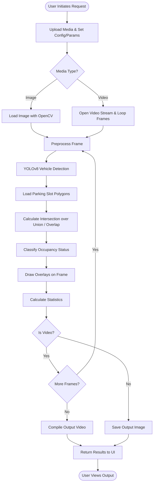

# Application Workflow

This document outlines the workflow steps for the primary use cases: Image Analysis and Video Analysis.

## Processing Workflow

## Detailed Steps

### Image Processing Workflow
1. User uploads an image and submits it via the frontend.
2. The image is processed through a pipeline: resizing, noise reduction, and optional edge detection.
3. YOLOv8 predicts bounding boxes for vehicles.
4. Slot configurations (JSON) are parsed into OpenCV polygon structures.
5. The pixel overlap area is computed for each vehicle bounding box against each slot polygon.
6. The system marks a slot occupied if the overlap ratio exceeds the user-defined threshold.
7. The image is annotated with red (occupied) and green (free) polygons, and summary statistics are compiled.
8. The final annotated image and stats are returned to the user.

### Video Processing Workflow
1. User uploads a video and submits it.
2. The system splits the video into frames at a configured sampling rate.
3. Each sampled frame goes through the same Image Processing Workflow.
4. Occupancy statistics are collected over time (e.g., frame-by-frame or per second).
5. The annotated frames are recompiled into an output video file.
6. The final output video and the temporal statistical data are provided to the user, allowing visualization on a line/bar chart.
